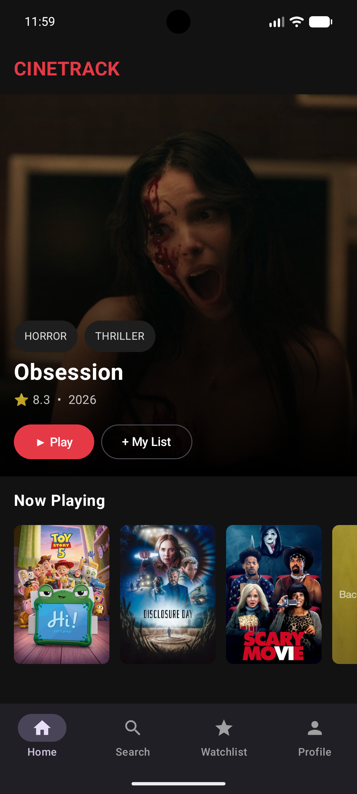
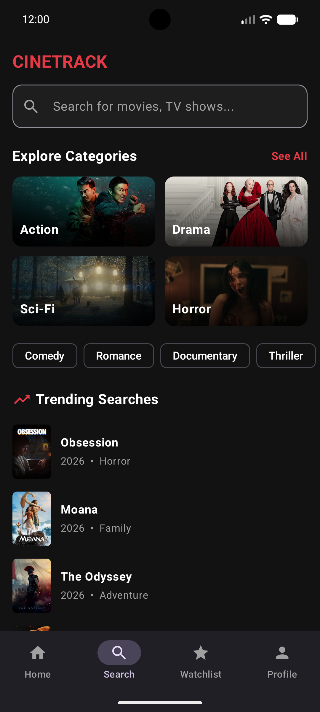
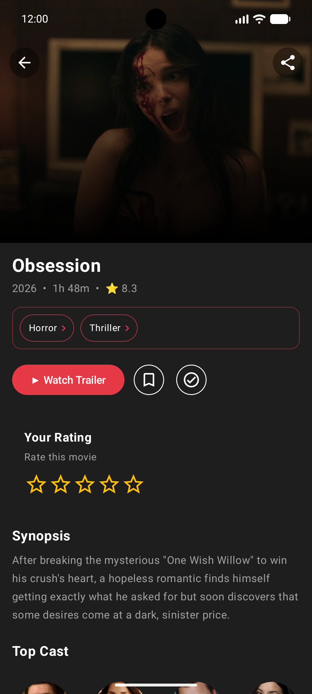
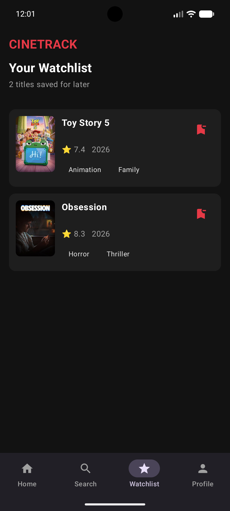
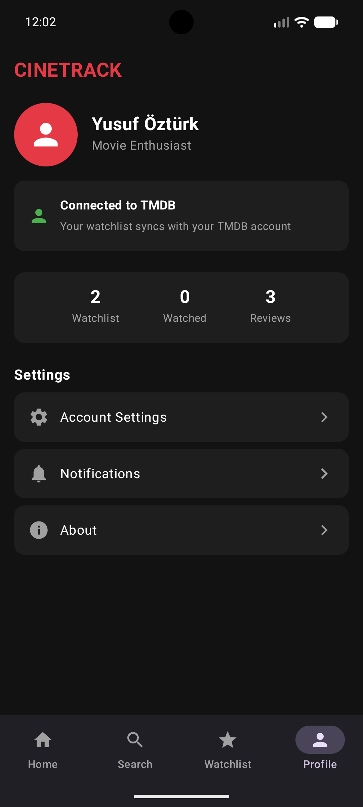
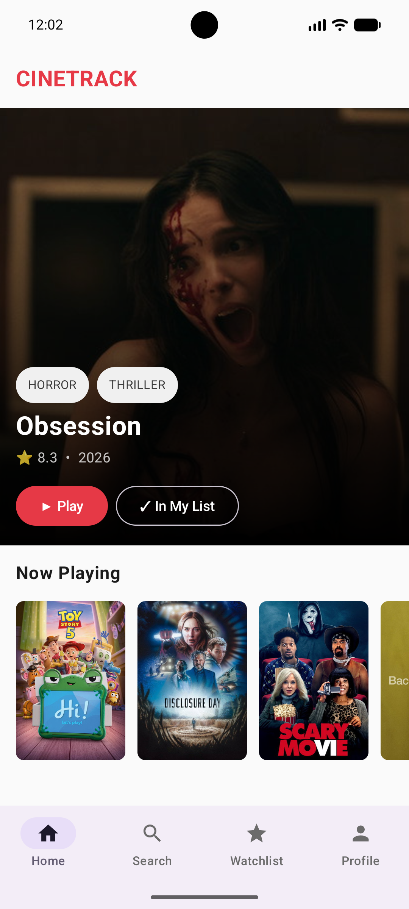

# 🎬 CineTrack

**[Türkçe](README.tr.md)** | English

A movie discovery and tracking app built with **Kotlin** and **Jetpack Compose**, powered by [The Movie Database (TMDB)](https://www.themoviedb.org/) API.

Browse popular titles, search across genres, keep a watchlist, rate movies, and sync it all with your TMDB account — no WebView, fully native.

---

## 📱 Screenshots

<!--
Drop your screenshots into a `screenshots/` folder at the project root, then
update the filenames below to match. Recommended: Home, Search, Movie Detail,
Watchlist, Profile, and one showing the light/dark theme side by side.
-->

| Home | Search | Movie Detail |
|---|---|---|
|  |  |  |

| Watchlist | Profile | Light / Dark |
|---|---|---|
|  |  |  |

---

## ✨ Features

- **Movie discovery** — popular titles, genre browsing with 19 categories, trending searches
- **Search** — debounced (400ms), paginated, with recent search history
- **Movie details** — trailer playback (YouTube), full cast with bios, similar movies (with proper back-stack navigation for chained similar-movie taps)
- **Watchlist & Ratings** — synced live with your TMDB account
- **Native authentication** — TMDB login flow without WebView
- **Light / Dark theme** — follows system setting
- **Robust error handling** — dedicated error states with retry, distinct from empty states, across every network-backed screen
- **Pull-to-refresh, shimmer/skeleton loading, splash screen**

## 🛠️ Tech Stack

- **Kotlin**, 100% **Jetpack Compose** (no XML/View system)
- **Architecture:** Clean Architecture — UI → ViewModel → UseCase → Repository
- **Networking:** Retrofit + OkHttp
- **Async:** Kotlin Coroutines + Flow
- **Image loading:** Coil
- **Local storage:** SharedPreferences (for auth session, search history, notification prefs)
- **Build system:** Gradle Kotlin DSL, AGP with built-in Kotlin

## 🏗️ Architecture

```
UI (ui/screens/) → ViewModel (ui/viewmodel/) → UseCase (domain/usecase/) → Repository (data/repository/) → Retrofit (data/api/) / SharedPreferences (data/local/)
```

```
app/src/main/java/com/yusufozturk/cinetrack/
├── data/
│   ├── api/          # Retrofit service, centralized network constants
│   ├── local/         # SharedPreferences wrappers (auth, search history, notification prefs)
│   ├── model/          # API response models + mappers
│   └── repository/    # AuthRepository, MovieRepository
├── domain/usecase/    # Business logic (GetMovieDetail, ToggleWatchlist, RateMovie, GetRatedMovies)
├── ui/
│   ├── components/    # Reusable composables (RatingBadge, GenrePill, ErrorStateView, ShimmerBox)
│   ├── screens/       # Home, Search, Genre, Watchlist, Profile, MovieDetail, Login, Settings
│   ├── theme/         # Color.kt, Theme.kt (light/dark)
│   └── viewmodel/     # MainViewModel (shared state), per-screen ViewModels
└── MainActivity.kt    # Manual state-based navigation (no Navigation Compose)
```

All hardcoded URLs are centralized in `NetworkConstants.kt` — no string literals scattered across the codebase.

## 🚀 Getting Started

1. Clone the repo:
   ```
   git clone https://github.com/yusufozturkdev-sudo/movie-app-android.git
   ```
2. Get a free API key from [TMDB](https://www.themoviedb.org/settings/api).
3. Create a `local.properties` file in the project root (if it doesn't exist) and add:
   ```
   TMDB_API_KEY=your_key_here
   ```
4. Open in Android Studio, sync Gradle, and run.

**Requirements:** Min SDK 24, Target/Compile SDK 36, Kotlin with Compose compiler plugin.

## 📋 Roadmap / Known Limitations

- No automated tests yet (unit tests planned)
- No dependency injection framework (manual constructor injection currently)
- No CI/CD pipeline yet
- Navigation is handled manually via state, not Jetpack Navigation Compose

## 📄 License

This project uses the TMDB API but is not endorsed or certified by TMDB.